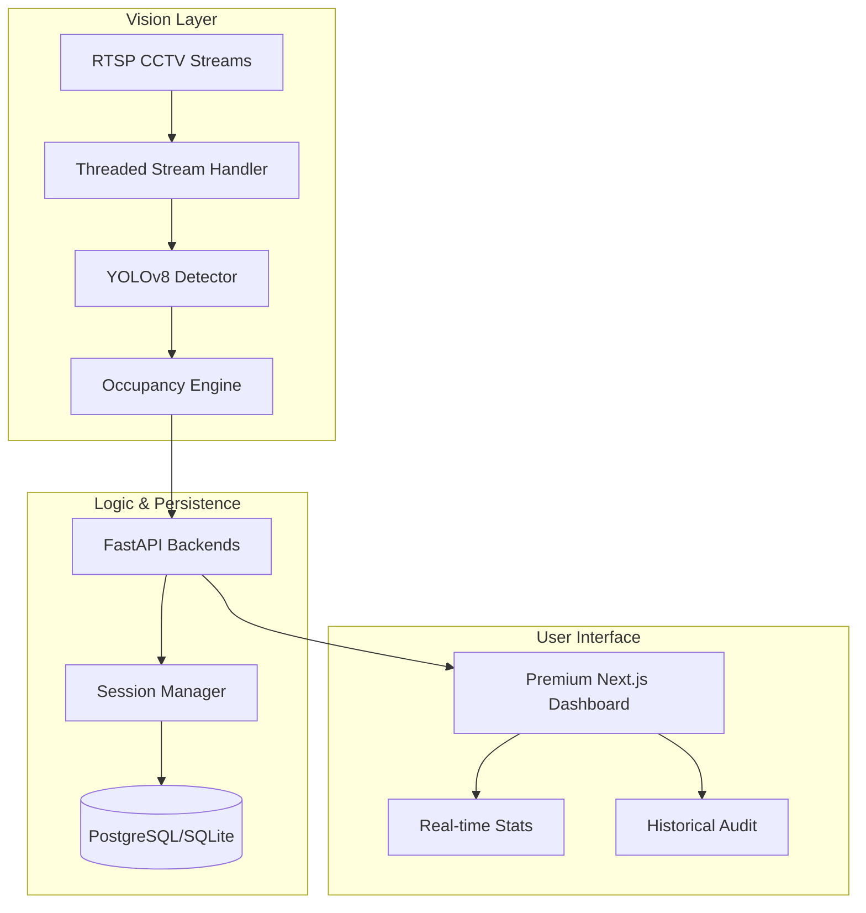

# 🖥️ Worker Seat Tracker MVP

[](https://fastapi.tiangolo.com)
[](https://nextjs.org/)
[](https://docs.ultralytics.com/)
[](https://www.docker.com/)

A production-ready, high-performance system for monitoring workplace seat occupancy from CCTV/RTSP streams. Designed for reliability, privacy, and modularity.

---

## ✨ Key Features

-   **🎯 Precision Vision**: YOLOv8-based person detection with resolution-independent spatial logic.
-   **🛡️ Robust Occupancy**: Intelligent debouncing (exit delay) to handle temporary walk-bys and occlusions.
-   **💎 Premium Dashboard**: Next-gen "Bento Grid" UI with glassmorphism, fluid animations, and real-time telemetry.
-   **🏭 Modular Architecture**: Decoupled vision pipeline, RESTful API, and modern frontend.
-   **🐳 Containerized**: Orchestrated with Docker Compose for seamless scaling.

---

## 🏗️ System Architecture



---

## 🚀 Quick Start

### 🐳 Docker (Recommended)
```bash
# Clone and deploy everything in one go
docker-compose up --build
```
*Backend runs on `8001`, Frontend on `3000`.*

### 🛠️ Manual Setup

#### 1. Backend
```bash
cd backend
pip install -r requirements.txt
cp .env.example .env
# Edit .env for DATABASE_URL or local setup
uvicorn app.main:app --host 0.0.0.0 --port 8001 --reload
```

#### 2. Frontend
```bash
cd frontend
npm install
npm run dev
```

---

## 📊 Business Logic

-   **Normalized Coordinates**: Seat zones are agnostic to camera resolution (0.0 to 1.0 mapping).
-   **Detection Threshold**: Occupancy triggered at >30% bounding box overlap.
-   **Exit Delay**: 5-second "debounce" period to ensure data integrity during movement.

---

## 📁 Repository Map

```text
├── backend/            # FastAPI + YOLO Detection Core
│   ├── app/
│   │   ├── api/       # REST Endpoints
│   │   ├── services/  # Business & Occupancy Logic
│   │   └── vision/    # YOLO & RTSP Pipeline
├── frontend/           # Premium Next.js 14 Dashboard
│   ├── app/           # High-end Animated Pages
│   └── components/    # Reusable UI Tokens
└── deployment/         # Docker Orchestration
```

---

## 🗺️ Roadmap (v2)
- [ ] **WebSockets**: Transition from polling to real-time events.
- [ ] **Zone Editor**: Visual UI for drawing seat zones on snapshots.
- [ ] **Dynamic Alerts**: Slack/Email notifications for long-duration absences.
- [ ] **Person Tracking**: Integration of ByteTrack for advanced occlusion handling.

---

Designed with ❤️ for modern workplaces.
