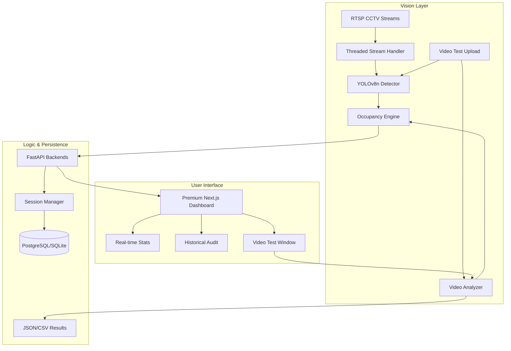

564# 🖥️ Worker Seat Tracker MVP

[](https://fastapi.tiangolo.com)
[](https://nextjs.org/)
[](https://docs.ultralytics.com/)
[](https://www.docker.com/)

A production-ready, high-performance system for monitoring workplace seat occupancy from CCTV/RTSP streams. Designed for reliability, privacy, and modularity.

---

## ✨ Key Features

-   **🎯 Precision Vision**: YOLOv8n-based person detection with resolution-independent spatial logic.
-   **🛡️ Robust Occupancy**: Intelligent debouncing (confirmation frames + exit delay) to handle temporary walk-bys and occlusions.
-   **🎬 Video Test & Calibration**: Upload recorded videos to test, validate, and calibrate occupancy tracking before live deployment.
-   **👤 Optional Person Tracking**: Lightweight centroid-based tracking for debugging and path analysis (disabled by default for CPU efficiency).
-   **💎 Premium Dashboard**: Next-gen "Bento Grid" UI with glassmorphism, fluid animations, and real-time telemetry.
-   **🏭 Modular Architecture**: Decoupled vision pipeline, RESTful API, and modern frontend.
-   **🐳 Containerized**: Orchestrated with Docker Compose for seamless scaling.
-   **⚡ CPU-Optimized**: Designed for Intel i5-8400, 24GB RAM, no GPU required.

---

## 🏗️ System Architecture



---

## 🚀 Quick Start

### 🐳 Docker (Recommended)
```bash
# Clone and deploy everything in one go
docker-compose up --build
```
*Backend runs on `8001`, Frontend on `3000`.*

### 🛠️ Manual Setup

#### 1. Backend
```bash
cd backend
pip install -r requirements.txt
cp .env.example .env
# Edit .env for DATABASE_URL or local setup
uvicorn app.main:app --host 0.0.0.0 --port 8001 --reload
```

#### 2. Frontend
```bash
cd frontend
npm install
npm run dev
```

---

## 📊 Business Logic

-   **Normalized Coordinates**: Seat zones are agnostic to camera resolution (0.0 to 1.0 mapping).
-   **Detection Threshold**: Occupancy triggered at >40% bounding box overlap (configurable).
-   **Confirmation Frames**: 2-frame confirmation before marking occupied (prevents flickering).
-   **Exit Delay**: 5-second "debounce" period to ensure data integrity during movement.
-   **Zone Occupancy**: Person detected inside seat zone = occupied (YOLO doesn't detect "sitting").

## 🎬 Video Test Module

The Video Test + Tracking Window provides a **diagnostic interface** into the occupancy system:

### Features
- **Upload & Analyze**: Test recorded videos with same logic as live CCTV
- **Zone Calibration**: Visually adjust seat zones with annotated output
- **Three Analysis Modes**:
  - `SEAT_OCCUPANCY_ONLY` (default): Fastest, zone detection only
  - `VIDEO_PERSON_TRACKING`: Temporary person IDs with path history
  - `HYBRID_DEBUG`: Full debug with overlays and detailed logs
- **Annotated Output**: Generated MP4 with bounding boxes, zone overlays, timestamps
- **Session Timeline**: Visual timeline of occupancy sessions per seat

### API Endpoints
```
POST /api/v1/video-test/upload      # Upload video file
POST /api/v1/video-test/analyze     # Start analysis job
GET  /api/v1/video-test/status/{id} # Check job progress
GET  /api/v1/video-test/result/{id} # Get analysis results
GET  /api/v1/video-test/download/{id} # Download annotated video
```

### Usage
1. Navigate to `Dashboard → Video Test`
2. Upload a test video (MP4, AVI, MOV, MKV, WebM)
3. Configure seat zones (or use presets)
4. Select analysis mode and start
5. Review results: session times, occupancy rates, annotated video

See [VIDEO_TEST_ARCHITECTURE.md](VIDEO_TEST_ARCHITECTURE.md) for detailed technical documentation.

---

## 📁 Repository Map

```text
├── backend/              # FastAPI + YOLO Detection Core
│   ├── app/
│   │   ├── api/         # REST Endpoints
│   │   │   ├── routes.py              # Core occupancy API
│   │   │   ├── routes_video_test.py   # Video test API
│   │   │   └── intelligence_routes.py # Analytics API
│   │   ├── services/    # Business & Occupancy Logic
│   │   │   ├── vision_service.py      # YOLO detection
│   │   │   └── camera_manager.py     # Live camera workers
│   │   └── video_test/  # Video Test Module
│   │       ├── analyzer.py           # Main pipeline
│   │       ├── session_tracker.py    # Occupancy state machine
│   │       ├── person_tracker.py     # Lightweight tracking
│   │       └── schemas.py            # Pydantic models
├── frontend/             # Premium Next.js 14 Dashboard
│   ├── app/
│   │   ├── page.tsx                 # Main dashboard
│   │   └── video-test/
│   │       └── page.tsx              # Video test window
│   ├── components/
│   │   └── video-test/              # Video test components
│   │       ├── VideoUploadPanel.tsx
│   │       ├── ZoneEditorPanel.tsx
│   │       ├── AnalysisControls.tsx
│   │       ├── ResultsSummary.tsx
│   │       ├── SessionTimeline.tsx
│   │       └── PersonTrackingPanel.tsx
│   └── lib/video-test/types.ts       # TypeScript types
├── VIDEO_TEST_ARCHITECTURE.md        # Detailed architecture docs
└── deployment/           # Docker Orchestration
```

---

## 🗺️ Roadmap

### ✅ Completed
- [x] **Video Test Module**: Upload, analyze, calibrate with recorded videos
- [x] **Zone Editor**: Visual UI for configuring seat zones
- [x] **Person Tracking**: Lightweight centroid-based tracking (optional)
- [x] **Occupancy State Machine**: Confirmation frames + exit delay debouncing
- [x] **Annotated Output**: Generated MP4 with overlays for debugging

### 🚧 In Progress
- [ ] **WebSockets**: Transition from polling to real-time events
- [ ] **Dynamic Alerts**: Slack/Email notifications for long-duration absences
- [ ] **Heatmap Analytics**: Visual heatmaps of seat utilization

### 📋 Planned
- [ ] **ByteTrack Integration**: Advanced person tracking (optional, feature-flagged)
- [ ] **Behavior Analysis**: Posture detection, activity recognition
- [ ] **Multi-Camera Sync**: Track people across camera boundaries
- [ ] **Mobile App**: iOS/Android companion for on-the-go monitoring

---

Designed with ❤️ for modern workplaces.
